# Slack ACP Communication Flow

This document explains how Slack ACP (Anthropic Claude Protocol) communication works in AionUi, starting from when a user types 'copilot --acp' in Slack.

## Current Status

**Important:** Slack integration is planned but not yet fully implemented. The architecture and flow described below represent the intended design based on existing patterns from Telegram, Lark, and DingTalk implementations.

## Architecture Overview

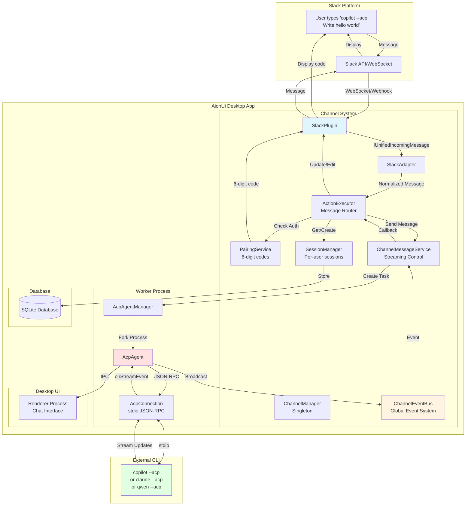

## Detailed Flow: User Message to AI Response

### Phase 1: User Authorization & Session Setup

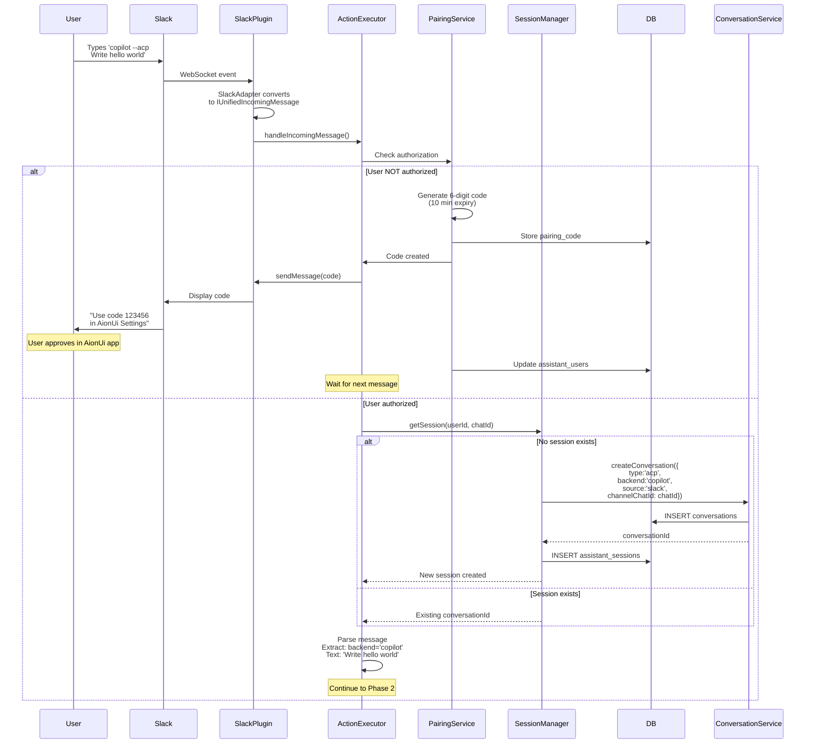

### Phase 2: Message Streaming Setup

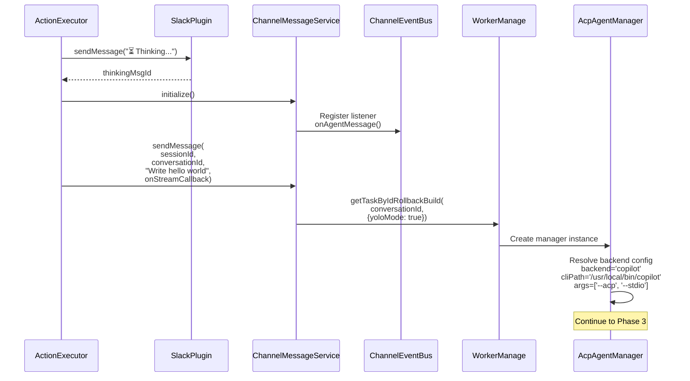

### Phase 3: ACP Agent Execution

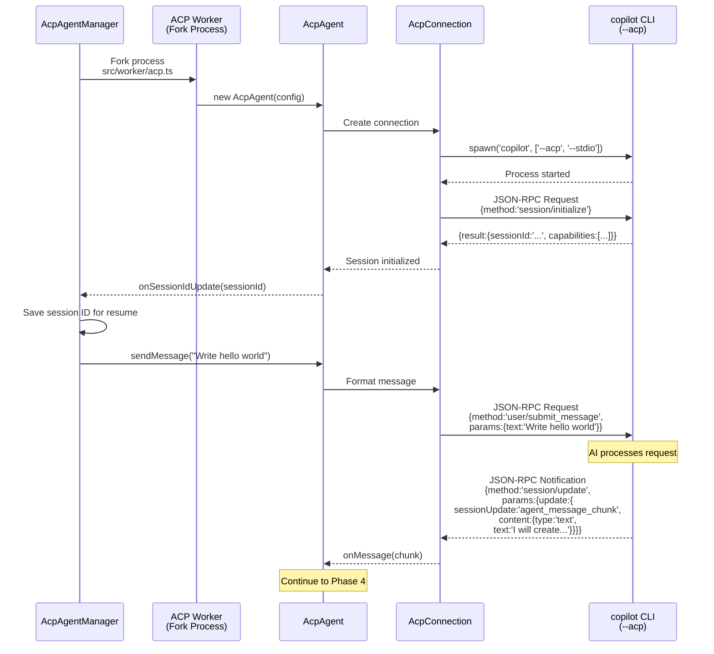

### Phase 4: Dual Broadcasting & Streaming

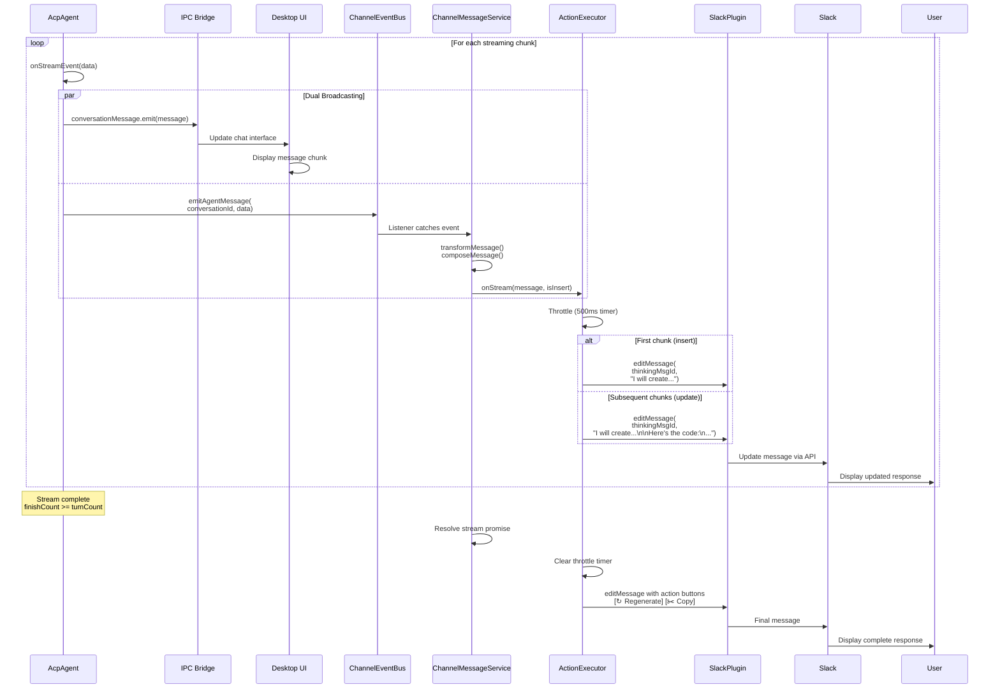

### Phase 5: Tool Confirmation (If Required)

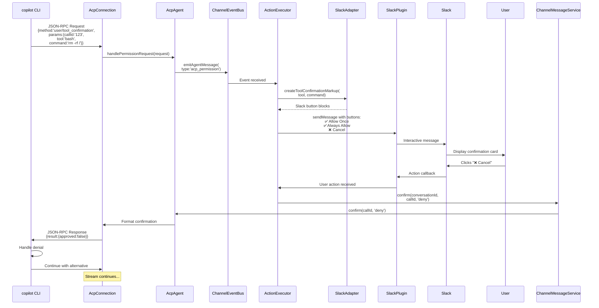

## Component Architecture

### Key Components

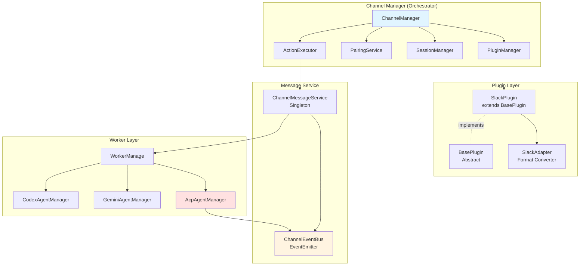

### Plugin Lifecycle State Machine

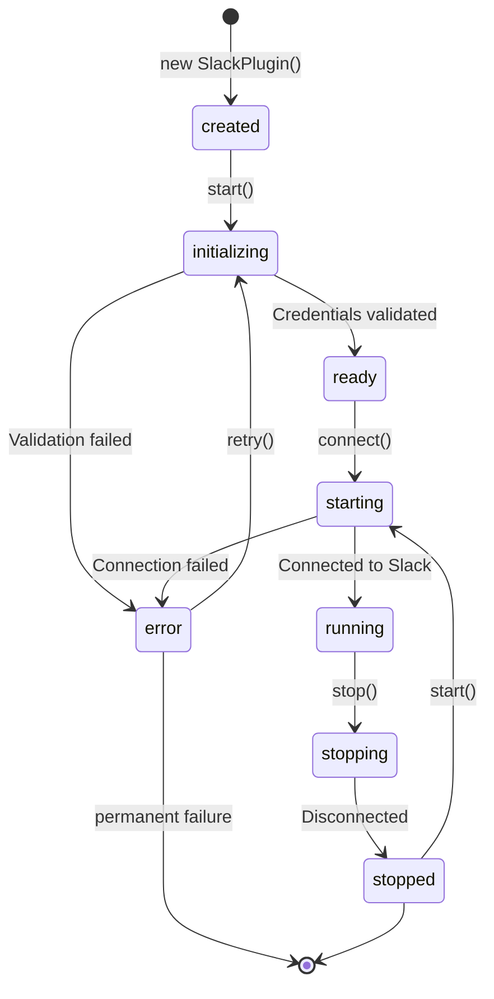

### Session & Conversation Isolation

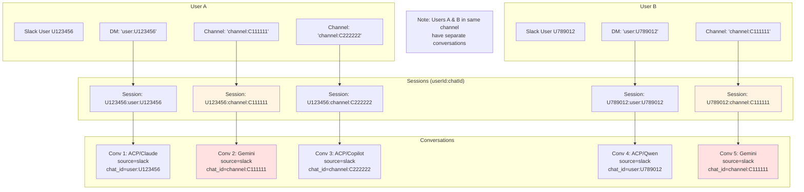

## Data Flow: Message Types

### Incoming Message Flow

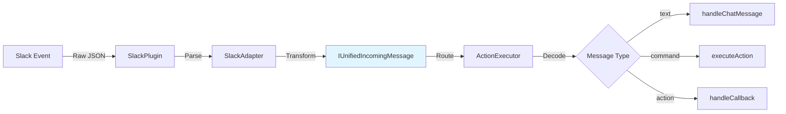

### Outgoing Message Flow

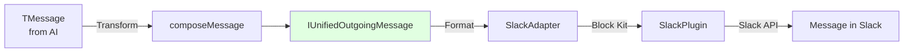

## Database Schema

### Tables & Relationships

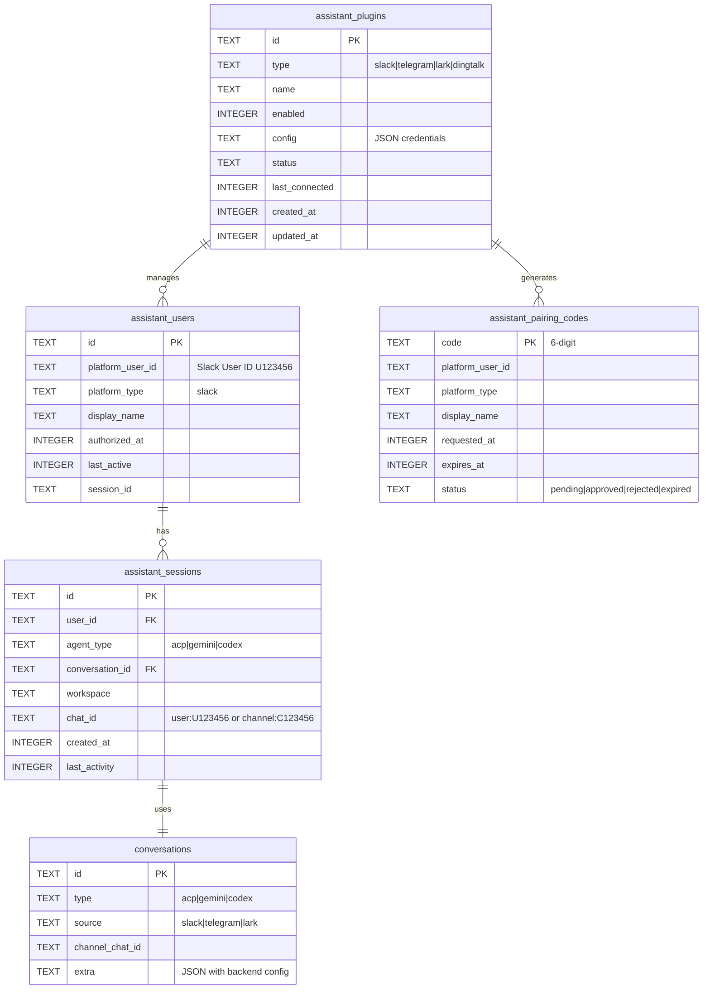

## ACP Backend Support

### Supported Backends

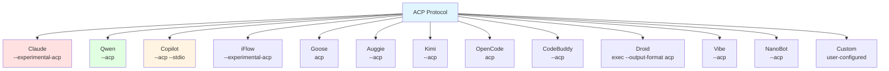

## Security & Authorization

### Pairing Flow

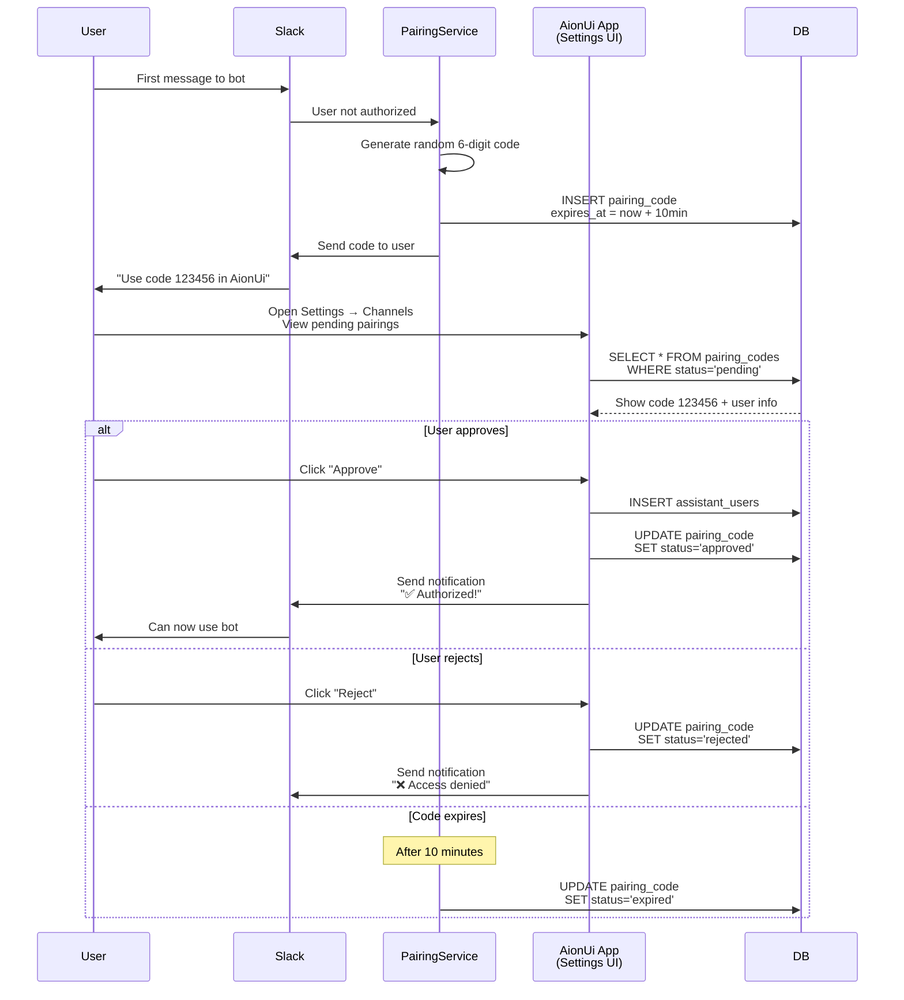

## Performance Optimizations

### Message Throttling

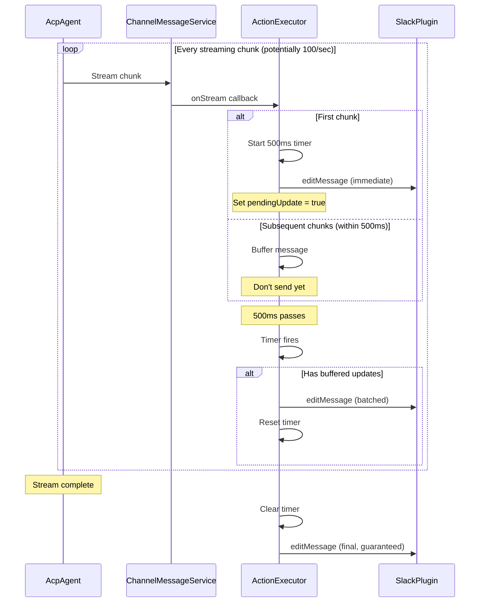

## Implementation Status

### Current State

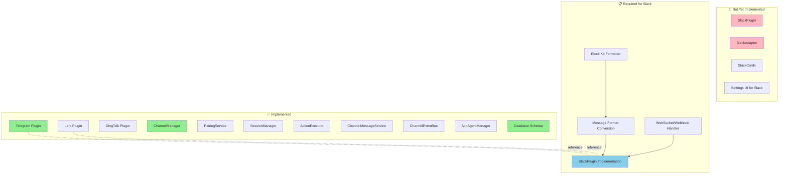

## Key Files & Responsibilities

| File Path | Purpose |
|-----------|---------|
| `src/channels/core/ChannelManager.ts` | Orchestrator, lifecycle management |
| `src/channels/gateway/ActionExecutor.ts` | Message routing, AI processing |
| `src/channels/agent/ChannelMessageService.ts` | Streaming control, flow management |
| `src/channels/agent/ChannelEventBus.ts` | Global event bus (agent→channel) |
| `src/channels/pairing/PairingService.ts` | Authorization, pairing codes |
| `src/channels/plugins/BasePlugin.ts` | Plugin abstraction layer |
| `src/process/task/AcpAgentManager.ts` | ACP agent lifecycle, dual broadcasting |
| `src/worker/acp.ts` | Fork wrapper, stdio communication |
| `src/agent/acp/index.ts` | AcpAgent class, ACP protocol implementation |
| `src/types/acpTypes.ts` | ACP backend definitions, type system |

## References

- **ACP Specification**: [Anthropic Claude Protocol](https://docs.anthropic.com/en/docs/acp)
- **Existing Implementations**:
  - `src/channels/plugins/telegram/TelegramPlugin.ts`
  - `src/channels/plugins/lark/LarkPlugin.ts`
  - `src/channels/plugins/dingtalk/DingTalkPlugin.ts`
- **Database Schema**: `src/process/database/migrations.ts`

---

**Document Version**: 1.0
**Last Updated**: 2026-02-28
**Status**: Architecture documented, Slack implementation pending
